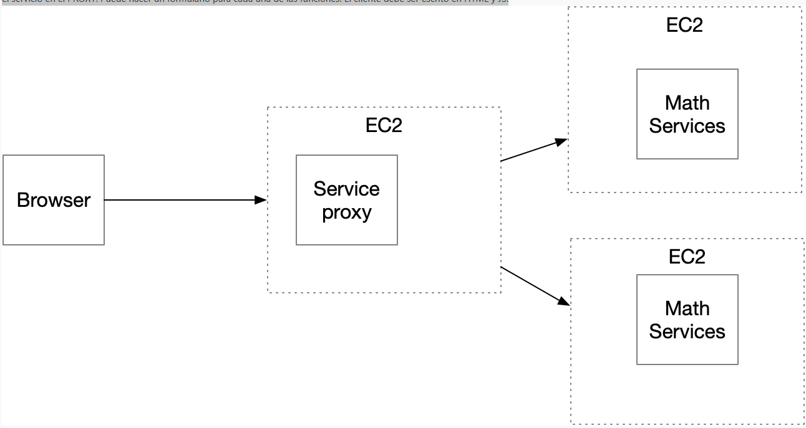
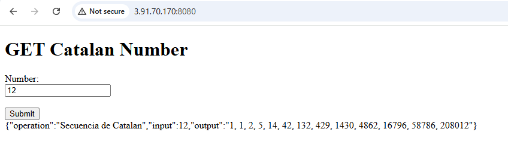

# AREP-Parcial2
### Autor
**Juan Esteban Medina Rivas** - Escuela Colombiana de Ingeniería Julio Garavito

*Este repositorio que abarca la solución al Parcial No. 2 de la materia AREP*

## Enunciado

Diseñe, construya y desplegue una aplicación web para investigar el problema matemático asignado. El programa debe estar desplegado en AWS. Las tecnologías usadas en la solución deben ser Maven, Git, GitHub, Spring, HTML5 y js. No use liberías adicionales.

## Problema

Diseñe un prototipo de sistema de microservicios que tenga un servicio (En la figura se representa con el nombre Math Services) para computar las funciones numéricas.  El servicio de las funciones numéricas debe estar desplegado en al menos dos instancias virtuales de EC2. Adicionalmente, debe implementar un service proxy que reciba las solicitudes de llamado desde los clientes  y se las delegue a las dos instancias del servicio numérico usando un algoritmo de activo-pasivo. Si uno de los servicios está caido debe dirigirla al otro.  El proxy deberá estar desplegado en otra máquina EC2. Asegúrese de poder configurar las direcciones y puertos de las instancias del servicio en el proxy usando variables de entorno del sistema operativo.  Finalmente, construya un cliente Web mínimo con un formulario que reciba el valor y de manera asíncrona invoke el servicio en el PROXY. Puede hacer un formulario para cada una de las funciones. El cliente debe ser escrito en HTML y JS.




## Solución 

### Video Despliegue

[Despliegue Aplicación MathServices + Proxy](/video/VideoDespliegueArepParcial2.mp4)


### Instancias EC2


### Testing Active-Pasive Proxy


### Despliegue Aplicación Web Minima




### Implementación Programación Dinámica

```java
private static final HashMap<Integer, Integer> resultsMap = new HashMap<>();

private int catalanNumber(int value) {
    if (value == 0)
        return 1;

    if (resultsMap.containsKey(value))
        return resultsMap.get(value);

    int sum = 0;
    for (int i = 0; i < value; i++) {
        sum += (catalanNumber(i) * catalanNumber(value - 1 - i));
    }

    resultsMap.put(value, sum);
    return sum;
}
```